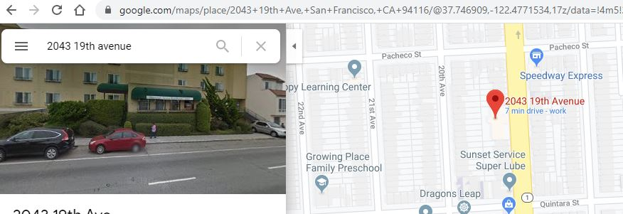

Solve a mystery with a data visualization
========================================

In this assignment you and a partner will write a computer program to help solve a crime. The police have possession of a smartphone and they have asked you to determine if the data from the phone supports the suspects’ claim of innocence. Investigators were able to gather time stamped gps coordinates from the suspects phone in the format (latitude, longitude, 24 hr time): e.g. (37.747201,-122.503728,"13:00").
 
The suspect, Aces Peck, has been accused of breaking and entering. An alarm sounded at the storage unit for the senior facility run by CFI Care Inc. at 2043 19th Avenue 3:15pm on Sunday. Witnesses saw a male matching Aces’ description leaving the senior facility on foot shortly after the time of the break in. Aces lives near the corner of 45th Ave and Quintara. He claims that he only left his house at 1:30 pm to walk to the Safeway at 730 Taraval St. He says he bought a quart of milk and walked back home. He says he was at home at the time of the break in. Investigators have given you the following data from his phone:
```(37.747201,-122.503728,"13:00")   
(37.747201,-122.503728,"13:10")   
(37.747201,-122.503728,"13:20")   
(37.747201,-122.503728,"13:30")   
(37.7457331,-122.5001465,"13:40")   
(37.7459013,-122.4954998,"13:50")   
(37.7429473,-122.4875535,"14:00")   
(37.7430309,-122.4767629,"14:10")   
(37.7434253,-122.474164,"14:20")   
(37.7434253,-122.474164,"14:30")   
(37.7434253,-122.474164,"14:40")   
(37.7448167,-122.4756721,"14:50")   
(37.7469956,-122.475964,"15:00")   
(37.7496281,-122.4764707,"15:10")   
(37.7486281,-122.4760707,"15:20")   
(37.7482044,-122.4858554,"15:30")   
(37.7456825,-122.4985913,"15:40")   
(37.747201,-122.503728,"15:50")   
(37.747201,-122.503728,"16:00")
```
Our first step is to create a program that shows a map of the area around the crime. Run the following code and you should see a map of the outer sunset area of San Francisco:
```javascript
let sfmap;

function setup() {
  createCanvas(638, 348);
  sfmap = loadImage('https://raw.githubusercontent.com/APCSPrinciples/DataMystery/master/Map.PNG');
}

function draw() {
  image(sfmap, 0, 0, 638, 348);
}
```
Now mark the map with the scene of the crime.  To find the GPS coordinates of 2043 19th Avenue search for the location on Google Maps and then look in the URL. You should be able to see the latitude and longitude of the location

   

Now add the following code that will convert that GPS location into an x and y coordinate. It uses the p5 [map()](https://p5js.org/reference/#/p5/map) function to do the conversion. It then draws a red circle at that place on the map.
```javascript
let sfmap;
let minLat = 37.752242 // minimum latitude on sfmap
let maxLat = 37.728825 // maximum latitude on sfmap
let minLong = -122.509245 // minimum longitude on sfmap
let maxLong = -122.454380 // maximum longitude on sfmap

function setup() {
  createCanvas(638, 348);
  sfmap = loadImage('https://raw.githubusercontent.com/APCSPrinciples/DataMystery/master/Map.PNG');
}

function draw() {
  image(sfmap, 0, 0, 638, 348);
  let y = map(/* put latitude here */, minLat, maxLat, 0, height);
  let x = map(/* put longitude here */, minLong, maxLong, 0, width);
  fill(255, 0, 0);
  circle(x, y, 15);
}
```
Add the following arrays with the smartphone data to the program.
```javascript
let latitudes = [37.747201, 37.747201, 37.747201, 37.747201, 37.7457331, 37.7459013, 37.7429473, 37.7430309, 37.7434253, 37.7434253, 37.7434253, 37.7448167, 37.7469956, 37.7496281, 37.7486281, 37.7482044, 37.7456825, 37.747201, 37.747201];
let longitudes = [-122.503728, -122.503728, -122.503728, -122.503728, -122.5001465, -122.4954998, -122.4875535, -122.4767629, -122.474164, -122.474164, -122.474164, -122.4756721, -122.475964, -122.4764707, -122.4760707, -122.4858554, -122.4985913, -122.503728, -122.503728];
let time = [1300, 1310, 1320, 1330, 1340, 1350, 1400, 1410, 1420, 1430, 1440, 1450, 1500, 1510, 1520, 1530, 1540, 1550, 1600];
```
Just like the previous data visualization tutorial, add a `let cur = 0;` variable to keep track of the current location in the arrays. Then add the following code to display the suspects position along with the time on the map.
```javascript
  let suspectY = map(latitudes[cur], minLat, maxLat, 0, height);
  let suspectX = map(longitudes[cur], minLong, maxLong, 0, width);
  fill(0, 255, 0);
  circle(suspectX, suspectY, 15);
  fill(0);
  text("Time: " + time[cur], suspectX + 15, suspectY);
  ```
You will then need to figure out a way to make the `cur` variable progress through all the movements of the suspect. There is nothing to turn in for this assignment. If you think you know the answer to the mystery, call over your instructor and explain how you got your answer.
